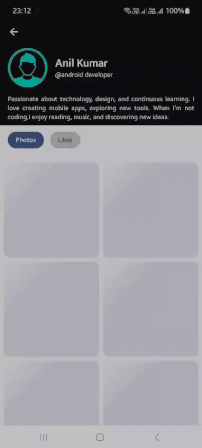
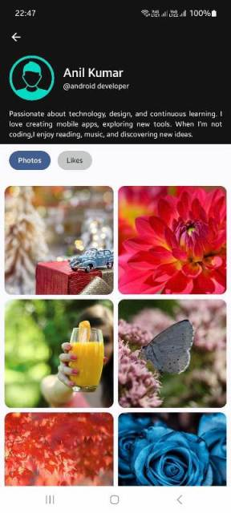
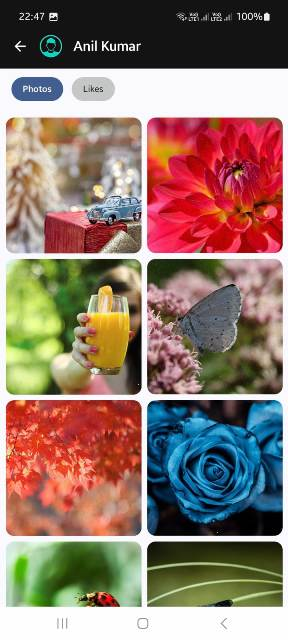
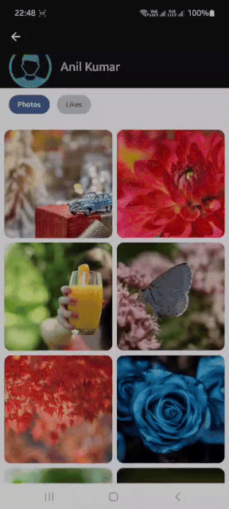

# CollapsingAppBar in Jetpack Compose


A modern Jetpack Compose example demonstrating a **Collapsing AppBar** with smooth animations.
Includes:

- Collapsed top bar with avatar and title
- Expanded header with profile image, name, and bio
- Smooth fade-in/fade-out and slide animations
- Customizable background colors for collapsed and expanded states
- Perfect for building profile screens or social apps in Compose

## Table of Contents

- [Key Features](#key-features)
- [Library Dependency](#Library-Dependency)
- [Screenshots](#screenshots)
- [Usage](#usage)
- [Jetpack Compose Example](#jetpack-compose-example)
- [WhatsApp Channel](#whatsapp-channel)
- [License](#License)

## Key Features

- Jetpack Compose modern UI
- AsyncImage loading with crossfade effect
- Expand/collapse animation logic
- Easily customizable for any app

## Library Dependency

**The CollapsingBar library is published on Maven Central.**


**Using direct dependency version**

   ```
   dependencies {
        implementation("io.github.team2681:collapsingbar:1.0.0")
    }
   ```    

**Using Version Catalog (libs.versions.toml)**

- Add this in your libs.versions.toml:

   ```
   [versions]
   collapsingbar = "1.0.0"

   [libraries]
   collapsingbar = { group = "io.github.team2681", name = "collapsingbar", version.ref = "collapsingbar" }
   ```

- Then in your module build.gradle.kts:

   ```
   dependencies {
        implementation(libs.collapsingbar)
   }
   ```

- Make sure mavenCentral() is included in your repositories:

   ```
   repositories {
        google()
        mavenCentral()
   }
   ```

## Screenshots

<table> <tr> <td></td> 
<td></td> 
<td></td> 
<td></td> 
</tr> <tr> <td>Loading State</td> <td>Expanded State</td> <td>Collapsed State</td> 
<td>Expanded & Collapsed Demo</td> </tr> </table>

## Usage

1. Clone this repo:

    ```bash
    git https://github.com/team2681/CollapsingAppBar-Demo-Jetpack.git
    ```
2. Open in Android Studio.

3. Run on your device or emulator.

## Jetpack Compose Example

   ```
   Scaffold(
        modifier = modifier
            .fillMaxSize()
            .nestedScroll(scrollBehavior.nestedScrollConnection),
        topBar = {
            CollapsingAppBar(
                scrollBehavior = scrollBehavior,
                title = "Title",
                subtitle = "@SubTitle",
                bioText = "Bio Text",
                showBackButton = false,  // Show/Hide Back button
                profileImage = Icons.Default.AccountCircle,
                imageMinSize = 32.dp,
                imageMaxSize = 60.dp,
                tintColor = Color.White,
                onBackClicked = {
                    Toast.makeText(context, "Back button clicked!", Toast.LENGTH_SHORT).show()
                },
                actions = {
                    IconButton(
                        onClick =
                            {
                                Toast
                                    .makeText(context, "Search clicked!", Toast.LENGTH_SHORT)
                                    .show()
                            }
                    )
                    {
                        Icon(Icons.Default.Search, contentDescription = "Search")
                    }
                    IconButton(
                        onClick =
                            {
                                Toast
                                    .makeText(context, "More options clicked!", Toast.LENGTH_SHORT)
                                    .show()
                            })
                    {
                        Icon(Icons.Default.MoreVert, contentDescription = "More options")
                    }
                }
            )
        }
       ){ innerPadding ->
          // Body content
          // Other UI elements...
       }

   ```

**Customize these parameters to fit your UI.**

- ```scrollBehavior```→ that controls the collapsing and expanding animation. Connect it to a
  scrollable container such as `LazyColumn` or `LazyList`.
- ```title``` → The main text or name displayed in the app bar. It scales and moves as the bar
  collapses.
- ```subtitle``` → The text displayed below the title when expanded. It fades out when collapsed.
- ```bioText```→ An optional bio or description shown only in the expanded state.
- ```profileImageUrl``` → The image source for the avatar. Accepts: A [Painter] (e.g., from
  `painterResource`), A network image (from an image loading library) Or `null` to hide the image
- ```imageMinSize```→ The minimum size (in dp) of the avatar when collapsed. Defaults to `32.dp`.
- ```imageMaxSize```→ The maximum size (in dp) of the avatar when expanded. Defaults to `70.dp`.
- ```shape```→ The shape of the avatar. Defaults to [CircleShape], but can be customized (e.g.,
  `RoundedCornerShape(8.dp)` for a square look).
- ```contentScale```→ Defines how the image should scale within its bounds. Common values
  are [ContentScale.Crop] or [ContentScale.Fit].
- ```tintColor```→ An optional color tint applied to the avatar image. Pass `null` to disable
  tinting.
- ```borderColor```→ The color of the avatar’s border. Defaults to
  `MaterialTheme.colorScheme.outlineVariant`.
- ```borderWidth```→ The width of the avatar’s border. Defaults to `2.dp`.
- ```showBackButton```→ Whether to display the back navigation icon. Defaults to `true`.
- ```onBackClicked```→ Callback invoked when the back button is pressed. Ignored if [showBackButton]
  is `false`.
- ```actions```→ A composable slot for action items (e.g., icons, menus) displayed on the right side
  of the top bar.
- ```expandedBackgroundColor```→ The background color of the app bar when fully expanded.
- ``` collapsedBackgroundColor``` → The background color of the app bar when fully collapsed.
- ```statusBarColor```→ The color of the status bar.

## WhatsApp Channel

Get Kotlin & Android Jetpack Compose tips on `What's App` **Join My Channel** :
[📚 Kotlin & Android Learning📚](https://whatsapp.com/channel/0029VbBGTNr90x2umLoWKU3z)

## License


This project is licensed under the Apache License 2.0.

See the full license [here](LICENSE).